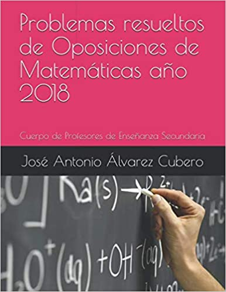

Libros de problemas
===================

    Problemas resueltos de Oposiciones de Matemáticas año 2018.

.. [AlvarezCubero:2020] Alvarez Cubero, Jose Antonio. 2018. `Problemas resueltos de Oposiciones de Matemáticas año 2018 <https://www.amazon.es/dp/B089CSZ64C?ref_=pe_3052080_397514860>`_. Independently published. ISBN-13=979-8649749961.